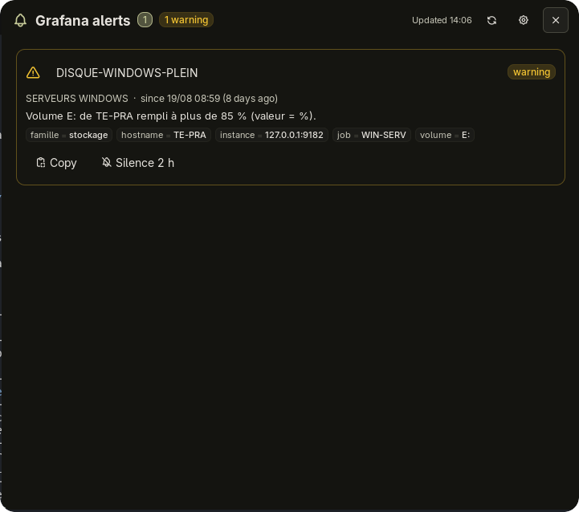
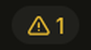

# Grafana Alerts

Firing Grafana alerts in your [Noctalia](https://noctalia.dev) bar: a counter tinted by
severity, and one click away a panel with the full list — severity, folder, summary,
labels — plus desktop notifications, one-click silences and copy-to-clipboard.



## Plugin

| Field | Value |
| --- | --- |
| ID | `fxthiry/grafana-alerts` |
| Entries | Bar widget: `bar`; panel: `panel`; service: `fetch` |

## Requirements

- A Grafana instance (v9+ unified alerting) reachable from your machine, and a
  **service account token**: Grafana → Administration → Users and access → Service
  accounts → *Add service account* (role Viewer) → *Add service account token*.
  Creating silences from the panel needs the **Editor** role (or the
  `alert.silences:create` permission); with a Viewer token the panel shows the 403 error
  on the card and nothing else changes.
- `notify-send` on `PATH` for desktop notifications (libnotify; Noctalia's own
  notification server displays them).
- `xdg-open` on `PATH` to open an alert in your browser when you click its name.

The token is stored in Noctalia's settings (`~/.local/state/noctalia/settings.toml`),
never in this repository.

## Usage

Install and enable:

```sh
git clone https://github.com/fxthiry/noctalia-grafana-alerts ~/.local/share/noctalia/plugins/grafana-alerts
noctalia msg plugins enable fxthiry/grafana-alerts
```

Then fill in **Grafana URL** and **API token** in Settings → Plugins → Grafana Alerts.

**Bar widget** — add it in Settings → Bar → Add widget → *Grafana Alerts*, or in TOML:

```toml
[widget.grafana]
type = "fxthiry/grafana-alerts:bar"
```



It shows the number of firing alerts; glyph and tint follow the worst severity
(octagon / triangle / bell, check mark when all clear). The tooltip gives the per-severity breakdown and the
last error, if any. Left click opens the panel, right click opens the settings.

**Panel** — click the widget, or:

```sh
noctalia msg panel-toggle fxthiry/grafana-alerts:panel
```

One card per alert: severity badge, name (click opens the alert in Grafana), folder,
start time and age, summary, label chips, then two actions:

- **Copy** — name, folder, summary, `label=value` lines and URL to the clipboard.
- **Silence 2 h** → **Confirm** (6 seconds to click) — creates an Alertmanager silence
  matching the alert's labels, exactly like Grafana's own *Silence* button. The list
  refreshes right after and the alert disappears.

The badges in the header filter the list by severity (click again, or the total, to
clear). The refresh button forces a fetch; the gear opens the settings.

**Desktop notifications** — when a new alert starts firing you get a `notify-send`
notification (urgency `critical` for critical alerts), and a low-urgency *Resolved* one
when a known alert stops firing — but not when you silenced it yourself. The first fetch
after startup (and the first one after a settings change) is a baseline and never
notifies; more than 3 changes of a kind in one fetch produce a single summary
notification.

## Settings

Settings → Plugins → Grafana Alerts:

| Setting | Type | Default | Description |
| --- | --- | --- | --- |
| `grafana_url` | `string` | — | Base URL, e.g. `https://grafana.example.com`. |
| `api_token` | `string` | — | Service account token (Viewer to read, Editor to create silences). |
| `refresh_interval` | `int` | `60` | Polling interval in seconds (15 minimum). |
| `ignore_datasource_alerts` | `bool` | `true` | Hide Grafana's internal `DatasourceNoData` / `DatasourceError` alerts. |
| `filters` | `string_list` | `[]` | Alertmanager matchers appended to the request, one per entry: `team=infra`, `env!~"staging\|dev"`. |
| `severity_label` | `string` | `severity` | Label carrying the severity (`level`, `priority`…). Always hidden from the chips. |
| `hidden_labels` | `string_list` | `alertname, grafana_folder, severity` | Labels not shown as chips (`__*` labels are always hidden). |
| `critical_color` | `color` | `#ff5c5c` | Color for critical alerts: bar tint, badges, card borders. |
| `warning_color` | `color` | `#f1c232` | Color for warning alerts. |
| `notify_new_alerts` | `bool` | `true` | Desktop notification for every new alert. |
| `notify_min_severity` | `select` | `warning` | Minimum severity to notify (firing and resolved): `critical`, `warning`, `info` or all. |
| `notify_resolved` | `bool` | `true` | Low-urgency notification when a known alert stops firing (not when you silence it). |
| `show_silence_button` | `bool` | `true` | Show the *Silence* action on each card. |
| `silence_duration` | `int` | `120` | Length of the silences created from the panel, in minutes. |
| `allow_insecure_tls` | `bool` | `false` | Accept self-signed certificates. |

Bar widget (Settings → Bar → *Grafana Alerts* widget):

| Setting | Type | Default | Description |
| --- | --- | --- | --- |
| `glyph_by_severity` | `bool` | `true` | Octagon for critical, triangle for warning, bell otherwise; check mark when nothing is firing. |
| `glyph` | `glyph` | `alert-triangle` | Icon shown while loading, on error, and always when `glyph_by_severity` is off. |
| `hide_when_zero` | `bool` | `false` | Hide the widget when nothing is firing. |

## Notes

- **Network**: `GET <grafana_url>/api/alertmanager/grafana/api/v2/alerts` (active, not
  silenced, not inhibited, plus your `filters`) on every refresh, and
  `POST <grafana_url>/api/alertmanager/grafana/api/v2/silences` when you confirm a
  silence. Nothing else; the token is only ever sent to the configured Grafana URL.
- **Processes**: `notify-send` for notifications, `xdg-open` when you click an alert
  name.
- **Files**: none written by the plugin.
- **Silence matchers**: one `=` matcher per label of the alert, except the `__grafana_*`
  routing labels, with `createdBy = noctalia`.
- **Severity buckets** — Grafana has no fixed vocabulary, so the severity label is
  mapped: `critical` (+ `crit`, `error`, `fatal`, `emergency`, `p1`), `warning` (+ `warn`,
  `high`, `major`, `p2`), `info` (+ `informational`, `notice`, `low`, `minor`); anything
  else is "other". Alerts are sorted by severity, then start time (newest first).
- **Debugging**: `tail -f ~/.cache/noctalia/noctalia.log | grep grafana`.

## Development

`.luau` files hot-reload; manifest changes need a plugin disable/enable.

```sh
noctalia plugins lint .          # declared settings ↔ code
noctalia msg plugins list        # plugin state on the running instance
curl -O https://raw.githubusercontent.com/noctalia-dev/official-plugins/main/noctalia.d.luau   # luau-lsp types (gitignored)
```

| File | Role |
| --- | --- |
| `plugin.toml` | Manifest: settings, entries (service, widget, panel) |
| `service.luau` | Background service: HTTP calls (alerts, silences), normalisation, sorting, notifications, shared state |
| `bar.luau` | Bar widget: glyph + counter, severity tint, click → panel, right click → settings |
| `panel.luau` | Panel: severity filter, alert cards (badge, summary, chips), copy and silence actions |
| `translations/` | UI strings (`en.json`) |

## License

MIT.
